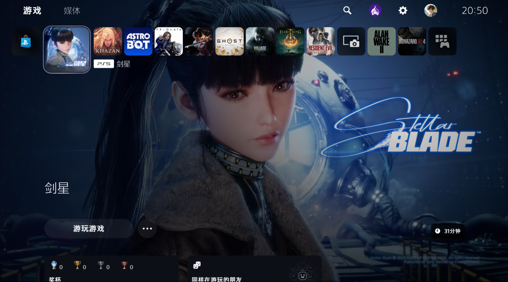
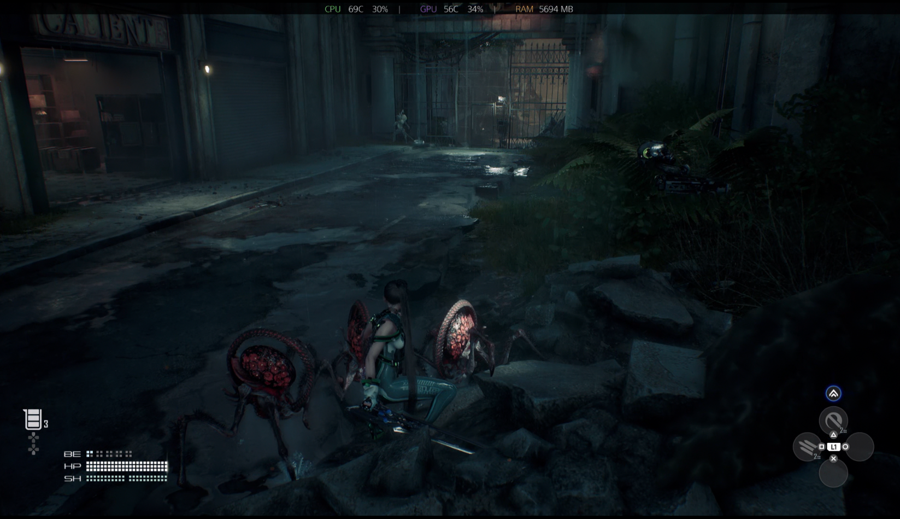
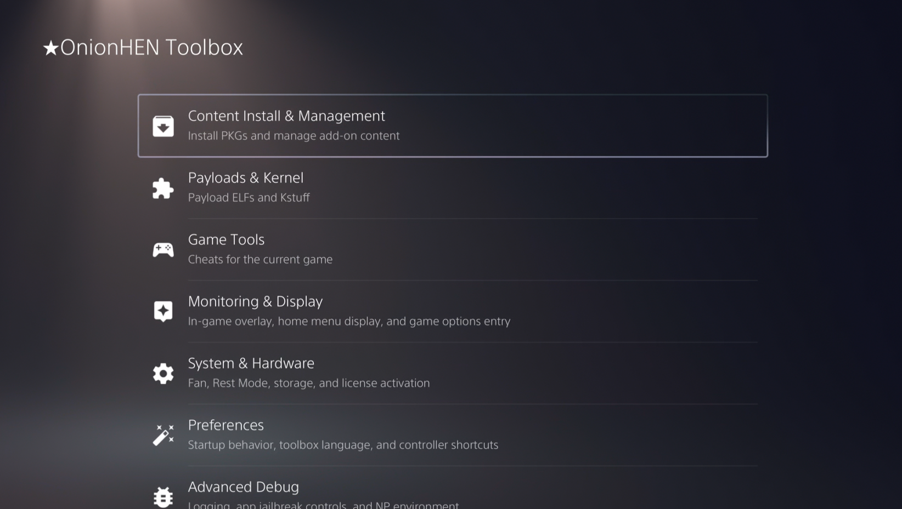

<p align="center">
  
</p>

<p align="center">
  <b>OnionHEN</b><br/>
  An all-in-one HEN and Toolbox for PlayStation 5
</p>

<p align="center">
  <a href="README_ZH.md">简体中文</a>
  ·
  <b>English</b>
</p>

<p align="center">
  <b><a href="#features">Features</a></b>
  ·
  <b><a href="#run">Run</a></b>
  ·
  <b><a href="#build">Build</a></b>
  ·
  <b><a href="#configuration">Configuration</a></b>
  ·
  <b><a href="#support">Support</a></b>
  ·
  <b><a href="#credits">Credits</a></b>
</p>

---

<p align="center">
  <a href="LICENSE"></a>
  
  
  
  
</p>

<p align="center">
  OnionHEN is a modular payload stack for the PS5. One entry ELF prepares
  the system, injects a ShellUI Toolbox,<br/>and then runs overlays, cheats,
  payloads, and background services.
</p>

<p align="center">
  
</p>

<p align="center">
  
</p>

<p align="center">
  
</p>

<br>

# Features

OnionHEN is a practical homebrew stack for jailbroken PS5 consoles.

- **ShellUI Toolbox** — a settings page injected into the PS5 ShellUI
- **System preparation** — raise privileges, remount filesystems, and block the update partition
- **fSELF / fPKG** — bundled kstuff for homebrew SELF / PKG; loads by default, can be turned off in the Toolbox
- **PS5 FTP server** — built-in source module with configurable port
- **Remote Play pairing** — enable the native PS5 Remote Play service, generate a pairing PIN, and register a client from the Network section
- **User payload manager** — start and stop user-provided `.elf` payloads, with optional auto-start
- **Game overlay** — an in-game bar for FPS, CPU, GPU, RAM, temperatures, and network info
- **Cheat engine** — local JSON, SHN, MC4, and ShnExt files that can be toggled at runtime
- **Console tools** — account activation, external HDD, Title IDs, fan control, shortcuts, and game options
- **App jailbreak** — allowlisted homebrew can ask the daemon for extra privileges through a sandbox FIFO
- **Resilient runtime** — the critical daemon and utility daemon run apart; the main daemon can restart the utility
- **Shared configuration** — the Toolbox and daemons use one versioned `config.ini`

OnionHEN does not include a kernel exploit. The first hop still needs an
external `elfldr` on **9021**. After that, OnionHEN starts its own private
loader on **9020** for later ELF and user-payload launches.

<br>

# Run

### Requirements

1. A jailbroken PS5
2. An external [PS5 `elfldr`](https://github.com/ps5-payload-dev/elfldr) listening on port **9021** for the first hop

### Load OnionHEN

1. Run the kernel exploit and start the external `elfldr` service.
2. Send `OnionHEN.elf` through the loader your exploit host provides.
3. Wait for the utility daemon, `kstuff`, and the main daemon to start, in that order.
4. Open PS5 Settings and enter the OnionHEN Toolbox.

Startup is sequential. After the first hop, OnionHEN uses its own
`onion_elfldr.elf` on port **9020** and keeps **9021** only as a fallback.

```text
OnionHEN.elf → bootstrapper → onion_elfldr.elf (:9020) → util.elf → kstuff.elf → daemon.elf → Toolbox
```

If `ftp.autoload` is enabled, the built-in FTP module starts after `kstuff` and
before the daemon.

### FTP server

The PS5 FTP server is available from **Toolbox → Plugins → FTP server**. One
switch starts or stops it in the current session. A separate switch starts it
the next time OnionHEN launches. The plugin page accepts ports from `1` to
`65535` and applies a new port by restarting the in-process listener. It
includes the upstream `ftpsrv` commands such as `KILL`, `SELF`, `SCHK`, `MTRW`,
and `AUTHID` where supported.

### Remote Play

Remote Play pairing is available from **Toolbox → Network → Remote Play**.
The current account must already be activated. If it is not, OnionHEN blocks
the Remote Play page and directs you to **Toolbox → Account → Account
activation**. Once the account is activated, OnionHEN enables the Remote Play
registry setting and displays the pairing PIN. Enter that PIN in the official
Remote Play client while the page is open; OnionHEN uses the native PS5 Remote
Play service to confirm the registered device.

The feature provides pairing and registration only. Video streaming and client
transport remain handled by Sony's native Remote Play service.

### Payloads

Place standalone payloads in:

```text
/data/OnionHEN/payloads/
```

Only plain `.elf` files are supported. Auto-start can be turned on in the Toolbox;
OnionHEN remembers that choice with a matching `.auto_start` file next to the ELF.

All `.elf` filenames use the same Payload page, loader, and auto-start flow,
including `kstuff`, `ftpsrv`, and `ftpsrv-ps5`. A recorded running instance is
left running by later launch and auto-start requests. Built-in services manage
only their own runtime; they do not stop same-name user Payloads. If two FTP
services use the same TCP port, only one can bind it.

### Cheats

Put cheat files in one directory. Names are `TITLEID_VERSION`, with an
optional process and 8-hex source ID:

```text
/data/OnionHEN/cheats/<TITLE_ID>_<VERSION>[_<PROCESS>][_<SOURCE_ID>].json
/data/OnionHEN/cheats/<TITLE_ID>_<VERSION>[_<PROCESS>][_<SOURCE_ID>].shn
/data/OnionHEN/cheats/<TITLE_ID>_<VERSION>[_<PROCESS>][_<SOURCE_ID>].mc4
/data/OnionHEN/cheats/<TITLE_ID>_<VERSION>[_<PROCESS>][_<SOURCE_ID>].ShnExt
```

`PROCESS` is optional. `SOURCE_ID` is a stable physical-source discriminator.
OnionHEN loads every compatible source for the title/version/process, so
independent JSON, SHN, MC4 and ShnExt files can coexist. A source with an
explicit process is only used for that process; a source without one is
generic.

Cheats load from disk. If a file changes, OnionHEN reloads it without restarting the whole stack.

`DOWNLOAD_CHEATS` downloads a cheat catalog ZIP over HTTPS (GitHub or cnb.cool), extracts the `cheats/` tree, and copies `json/`, `shn/`, and `mc4/` files into this directory with their original names. `[cheats] mirror=auto` uses cnb.cool when the UI/system language is Simplified Chinese, otherwise GitHub.

<br>

# Build

### Dependencies

| Dependency | Purpose |
| --- | --- |
| [PS5 Payload SDK](https://github.com/ps5-payload-dev/sdk) | Prospero compiler, target headers, runtime, and CMake wrapper |
| CMake 3.20+ and Ninja | Configure and build the payload graph |
| Clang / LLVM | Compile the `x86_64-sie-ps5` targets |
| `lzma` or `xz` | Compress the bootstrapper |
| Git and `curl` or `wget` | Initialize submodules and fetch external payload inputs |

The pinned [`drakmor/ftpsrv`](https://github.com/drakmor/ftpsrv) `nexgen`
sources are compiled into `util.elf` as its FTP module.

### Full build

```shell
git submodule update --init --recursive

export PS5_PAYLOAD_SDK=/path/to/ps5-payload-sdk
./scripts/build.sh --jobs 8
```

The script configures the project, fetches external dependencies, and builds
the embed chain in the required order.

For the reproducible Docker build:

```shell
docker compose build onionhen-build
docker compose run --rm onionhen-build
```

### Common options

| Option | Description |
| --- | --- |
| `--build-type Debug\|Release` | Select the CMake build type |
| `--build-dir <path>` | Override the default `build/` directory |
| `--cache-dir <path>` | Override `.cache/dependencies/` |
| `--stub-missing` | Use compile-only placeholder external ELFs; never use on hardware |
| `--skip-unpacker` | Stop after building the bootstrapper |
| `--init-submodules` | Initialize submodules before dependency sync |

Run `./scripts/build.sh --help` for the complete option list.

### Outputs

| Path | Description |
| --- | --- |
| `build/bin/OnionHEN.elf` | Final payload sent to the console |
| `build/bin/bootstrapper.elf` | Uncompressed bootstrapper |
| `build/bin/bootstrapper.elf.lzma` | Bootstrapper embedded by the final payload |
| `build/bin/daemon.elf` | Critical daemon |
| `build/bin/util.elf` | Utility daemon |
| `build/bin/shellui.elf` | Toolbox injection payload |
| `build/lib/*.a` | In-tree static libraries |

Build outputs stay in `build/`. Downloads are cached in `.cache/dependencies/`.
Nothing is written back into `source/`.

### Tests

Host tests cover settings, IPC, payload helpers, cheat parsers, relocation,
Toolbox routing, and shared platform code:

```shell
make -C source/util/tests clean
make -C source/util/tests test -j8
```

Linking the host tests needs Keystone on `KEYSTONE_PREFIX`
(default: `/opt/homebrew`).

<br>

# Configuration

OnionHEN reads and writes the same config in two places:

```text
/data/OnionHEN/config.ini
/user/data/OnionHEN/config.ini
```

Most options can be changed in the Toolbox. The format is
`schema_version=1`. If no file exists, OnionHEN writes a commented
default from [`config.ini.example`](config.ini.example).

| Key | Default | Values |
| --- | --- | --- |
| `meta.schema_version` | `1` | `1` |
| `toolbox.language` | `system` | `system`, `zh-Hans`, `zh-Hant`, `en`, `ja`, `ko`, `fr`, `de`, `it`, `es`, `pt-BR`, `pl`, `ru`, `ar`, `th` |
| `startup.open_after_load` | `none` | `none`, `home_menu` |
| `home_screen.show_title_ids` | `false` | `true`, `false` |
| `game_menu.show_onionhen_options` | `true` | `true`, `false` |
| `cheats.memory_backend` | `default` | `default`, `libhijacker` |
| `cheats.mirror` | `auto` | `auto`, `github`, `cnb` |
| `app_jailbreak.debug_notifications` | `false` | `true`, `false` |
| `cooling.fan_control` | `automatic` | `automatic`, `temperature_threshold` |
| `cooling.temperature_threshold_celsius` | `77` | `0` through `100` |
| `overlay.enabled` | `true` | `true`, `false` |
| `overlay.background` | `true` | `true`, `false` |
| `overlay.edge` | `top` | `top`, `bottom` |
| `overlay.align` | `center` | `left`, `center`, `right` |
| `overlay.show_cpu` / `overlay.show_gpu` / `overlay.show_memory` / `overlay.show_fps` | `true` | `true`, `false` |
| `overlay.cpu_usage_mode` | `average` | `average`, `per_core` |
| `overlay.show_ip_address` | `false` | `true`, `false` |
| `shortcuts.cheats_menu` | `off` | `off`, `r3_l3`, `l2_triangle`, `long_options`, `long_share`, `share` |
| `shortcuts.toolbox` | `off` | `off`, `l2_r3`, `long_share`, `share` |
| `ftp.autoload` | `false` | `true`, `false` |
| `ftp.port` | `1337` | `1` through `65535` |

### Runtime data

| Path | Purpose |
| --- | --- |
| `/data/OnionHEN/payloads/` | User payload ELFs |
| `/data/OnionHEN/cheats/` | Cheat files |
| `/data/OnionHEN/cheats_tmp/` | Temporary HTTPS ZIP and extraction files, cleaned after sync |
| `/data/OnionHEN/kstuff.elf` | Optional runtime override with priority over the embedded `kstuff` |
| `ftpsrv` | In-process FTP source module; default port `1337` |
| `/data/OnionHEN/OnionHEN.log` | Main runtime log |
| `/data/OnionHEN/OnionHEN_crash.log` | Preserved daemon signal and backtrace log |
| `/data/OnionHEN/OnionHEN_util_daemon.log` | Utility daemon log |

<br>

# Host tools

| Tool | Purpose |
| --- | --- |
| [`scripts/daemon_log.py`](scripts/daemon_log.py) | Stream daemon logs from the console |
| [`scripts/shutdown_onion.py`](scripts/shutdown_onion.py) | Shut down the OnionHEN userland stack without killing `kstuff` |
| [`scripts/ps5_cmake.sh`](scripts/ps5_cmake.sh) | Run CMake through the PS5 payload SDK |
| [`scripts/sync_dependencies.sh`](scripts/sync_dependencies.sh) | Fetch or build external payload inputs |

<br>

# Repository layout

```text
.
├── assets/                    Project artwork
├── docs/                      Architecture and technical notes
├── scripts/                   Build, dependency, and host-side helpers
├── source/                    In-tree PS5 sources
│   ├── bootstrapper/          Startup and embedded payload chain
│   ├── daemon/                Critical daemon and Toolbox injection
│   ├── util/                  Utility daemon, IPC, and cheats
│   ├── shellui/               Toolbox and ShellUI hooks
│   ├── unpacker/              Final OnionHEN payload wrapper
│   ├── libonion_*/            Shared in-tree libraries
│   ├── common/                Shared low-level implementations
│   └── platform/ps5/stubs/    PS5 system-library link stubs
├── third_party/               External source, archives, and submodules
├── tools/                     Repository-side generators
├── build/                     Generated build outputs (ignored)
└── .cache/dependencies/       Downloaded external inputs (ignored)
```

See [the architecture document](docs/arch.md) for the complete module and IPC map.

<br>

# Troubleshooting

1. Before loading OnionHEN, make sure the external `elfldr` is reachable on port **9021**.
2. Make sure the payload was built for this firmware with a complete PS5 Payload SDK.
3. If the Toolbox does not appear, wait for `util → kstuff → daemon` to finish and check the logs.
4. If the build cannot get `kstuff.elf`, run `./scripts/sync_dependencies.sh` again or initialize the submodule.
5. When you report a problem, include firmware, exploit host, SDK version, build type, logs, and steps to reproduce.

<br>

# Contributing

See [CONTRIBUTING.md](CONTRIBUTING.md).

<br>

# Support

<a href="https://ko-fi.com/0xp0co"></a>

For Chinese users, you can also scan the QR codes below to donate:

国内用户也可以扫描下方二维码进行捐赠：

| Alipay (CN) | WeChat (CN) |
| --- | --- |
|  |  |

If OnionHEN is useful to you, consider supporting further development. Thank you.

<br>

# Credits

OnionHEN exists because of the PS5 homebrew and reverse-engineering community.

### Contributors

<p align="center">
  <a href="https://github.com/aydencharles/onionHEN/graphs/contributors">
    
  </a>
</p>

### Based on

- [etaHEN](https://github.com/LightningMods/etaHEN) — LightningMods and contributors; source base of this tree
- [GoldHEN](https://github.com/GoldHEN/GoldHEN) — SiSTR0 and contributors; the PS4 all-in-one HEN this project takes after

### Referenced

- [kstuff-lite](https://github.com/EchoStretch/kstuff-lite) — EchoStretch, sleirsgoevy, and contributors; Rest Mode Toolbox recovery follows its SceSysCore `NOTE_EXEC` watch for `NPXS40087` and wait for `libSceNpTrophy.sprx` / `libSceNpTrophy2.sprx`
- [ps5-payload-manager](https://github.com/itsplk/ps5-payload-manager) — itsplk; listen-socket rebind after Rest Mode (Unix IPC and TCP accept-fail self-heal) follows this project
- [HEN-Cheats-Collection](https://github.com/TeeKay87/HEN-Cheats-Collection) — TeeKay87; the community cheat collection downloaded by the built-in cheat sync
- [PHU Games Tools](https://github.com/ArkSama) — ArkSama; the in-game FPS counter follows PHU Games Tools skip-hook sampling (`/dev/dce` scanout and DMAP reads of `libSceAgcDriver`)

### Used or embedded

- [PS5 Payload SDK](https://github.com/ps5-payload-dev/sdk) — Prospero toolchain and headers
- [elfldr](https://github.com/ps5-payload-dev/elfldr) — first-hop loader on port 9021; not shipped in the payload
- [kstuff-lite](https://github.com/EchoStretch/kstuff-lite) — EchoStretch, sleirsgoevy, and contributors; optional `kstuff.elf`
- [ftpsrv](https://github.com/drakmor/ftpsrv) — drakmor and upstream contributors; in-process PS5 FTP server from `nexgen`
- [libhijacker](https://github.com/astrelsky/libhijacker) — astrelsky; process hijack and kernel R/W
- [NineS](https://github.com/buzzer-re/NineS) — buzzer-re; ShellUI injection
- [cJSON](https://github.com/DaveGamble/cJSON) — JSON parsing
- [7-Zip LZMA SDK](https://www.7-zip.org/sdk.html) — unpacker decompression
- [miniz](https://github.com/richgel999/miniz) — cheat-file decompression

### Testers

即食面, 雨之声, 大饼电玩, 安定区, 随风, 麒麟, 尼克库尔曼, 云, 啊烦, 小小蔡, B站谢锡榆, 荆枫

Thanks as well to everyone else who tested, researched, or sent usable feedback.

<br>

# License

This project is licensed under the [GNU General Public License v3.0](LICENSE).
Third-party components retain their respective licenses and notices.

> OnionHEN is an unofficial homebrew project and is not affiliated with Sony Interactive Entertainment.
> Use it only on hardware you own and at your own risk. No warranty is provided.
